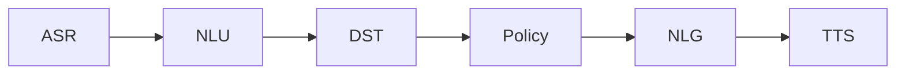

# prompt
提示工程，又称为指令工程。

## 高质量 prompt 核心要点：具体、丰富、少歧义

## Prompt 的典型构成
1. 角色：给 AI 定义一个最匹配任务的角色，比如：「你是一位软件工程师」「你是一位小学老师」
2. 指示：对任务进行描述
3. 上下文：给出与任务相关的其它背景信息（尤其在多轮交互中）
4. 例子：必要时给出举例，学术中称为 one-shot learning, few-shot learning 或 in-context learning；实践证明其对输出正确性有很大帮助
5. 输入：任务的输入信息；在提示词中明确的标识出输入
6. 输出：输出的格式描述，以便后继模块自动解析模型的输出结果，比如（JSON、XML）

## 对话系统的基本模块与思路：

## 思维链
- 思维链，是大模型涌现出来的一种神奇能力
- 有人在提问时以「Let’s think step by step」开头，结果发现 AI 会把问题分解成多个步骤，然后逐步解决，使得输出的结果更加准确

>大模型推理存在幻觉，多次执行结果可能会不一致

## 自洽性（Self-Consistency）
一种对抗「幻觉」的手段。就像我们做数学题，要多次验算一样。

核心原理：
* 同样的prompt执行多次，投票选出最终结果。
* 缺点：比较浪费token

## 思维树（Tree-of-thought, ToT）
以思维链发展出来的思想，扩展成一棵树。
- 在思维链的每一步，采样多个分支
- 拓扑展开成一棵思维树
- 判断每个分支的任务完成度，以便进行启发式搜索
- 设计搜索算法
- 判断叶子节点的任务完成的正确性

