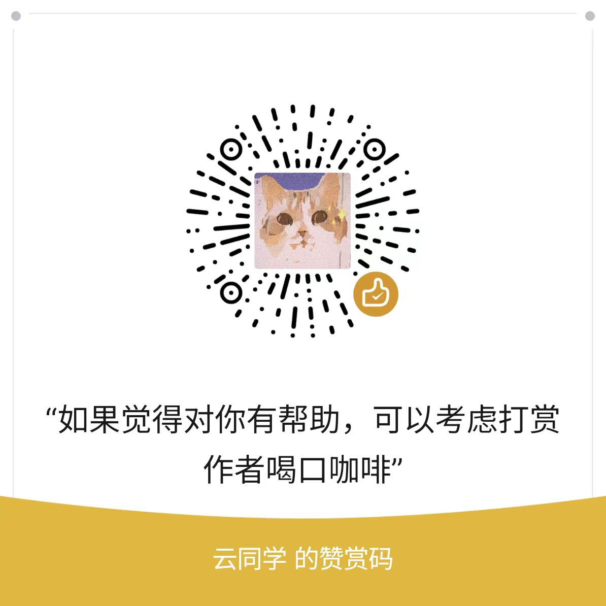

# Dev_AGI
AGI 通用人工智能开发示例代码

## 目录
- [agi_01_helloworld 一个简单的生成式AI](devagi/agi_01_helloworld)
- [agi_02_prompt](devagi/agi_02_prompt)
  - 一个简单的GPT客服多轮对话机器人
  - 基于思维链prompt客服质检示例
- [agi_03_funccall](devagi/agi_03_funccall)
  - 调用高德地图API实现多轮function calling
  - 实现function calling的联系人地址信息提取
- [agi_04_rag](devagi/agi_04_rag)
  - 基于Elasticsearch、NLTK 的问答示例
  - OpenAI embedding、chromadb 实现文本相似度检索
  - 基于向量检索的 RAG 生成式问答
- [agi_05_langchain](devagi/agi_05_langchain)
  - 基于 LangChain 实现向量检索的 RAG 生成式问答， 重构原生 API 的 ChatPDF 代码
  - [ChatPDF](devagi/agi_05_langchain/chat_pdf_view.py) 是一个基于 Langchain 的 Gradio 应用。 它使用 Langchain 提供的 PDF 解析和向量数据库功能， 并使用 OpenAI 的大模型来回答用户的问题。

## 联系方式

- 微信/邮箱：406811520@qq.com

## 支持
